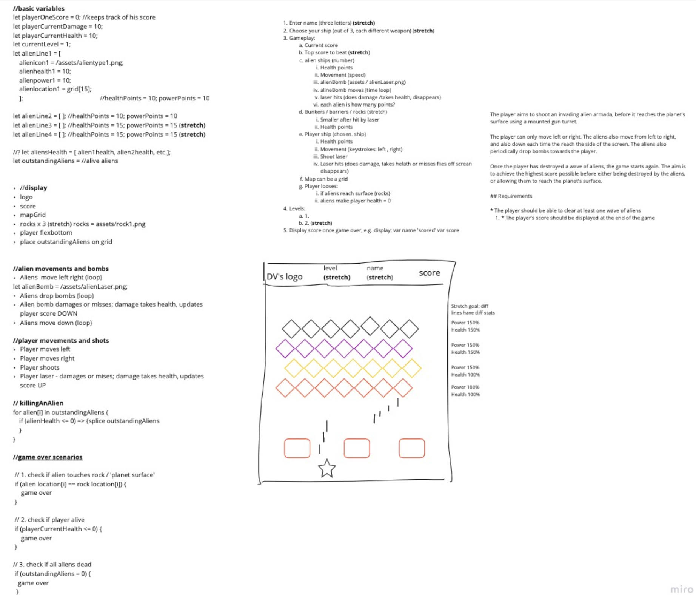
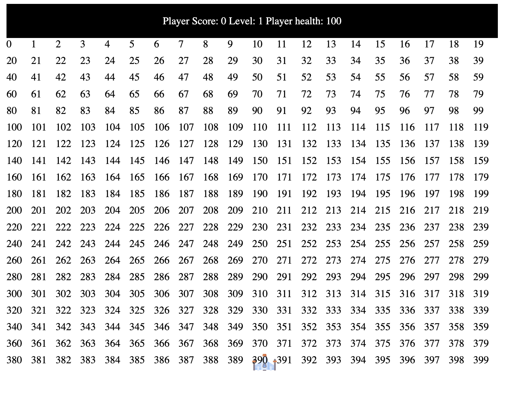
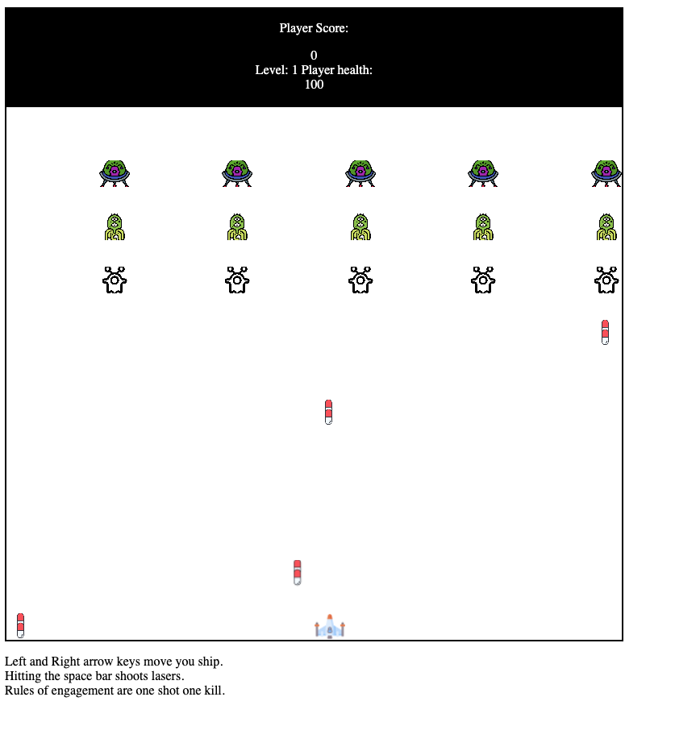
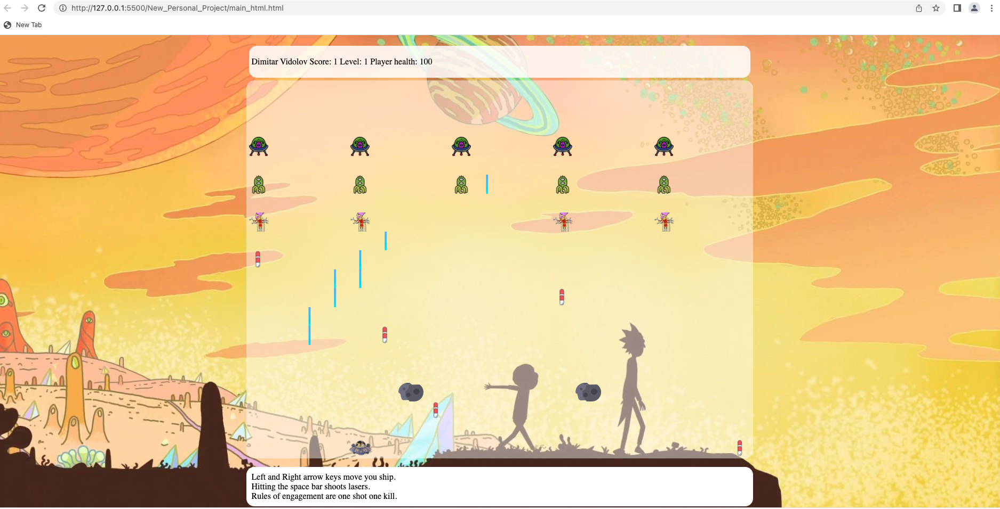

### 

# Invaders 23
 
Developed by Dimitar Vidolov.

## Overview

This is the first project of the software engineering immersive course at GA London. The assignment was to create a grid-based game to be rendered in the browser, using HTML, CSS and JavaScript. The project was to be completed **individually** within **6 days** over 3 weeks. 

Given a list of options from GA, I chose to re-create the classic game **Space Invaders**. 

You can play [here](https://dumblevor.github.io/spce_inv1/).

Preview: 
Controls are clearly visible on the right-hand side and you can toggle playing a catchy tune to go with your gameplay (stretch goal), not to mention the sound effects (stretch goal) and your pointer will disappear while playing (stretch goal).

## Technologies used 

- HTML
- CSS
- JavaScript
- Git and GitHub

## Approach

Space Invaders was one of the more interesting, with several moving parts and it seemed like a worthy challenge. 
Breaking it all down was key, from the 'sign-off' of the project.
Here is my whiteboard:

Activities are broken down into separate components, hardcoding is kept quite low for the most part.
The grid is generated (by makeGrid()) with a fixed size, elements on the grid are moved by adding and removing classes on the grid with time intervals and I put listeners to detect collisions.
The locations of the elements are all kept in separate arrays.

Whiteboarding it using Miro:


## Timeline
- Day 1 - Planning & pseudo
- Day 2 - MVP up
- Day 4 - Improving movement, adding infinite levels (stretch 2 goals) and a modal (stretch 2 goal).
- Day 5 - High-value low-effort features added like music, background, animations for explosions and a 'flying' ship. 

### Day 2
Set up the grid, and figured out the spacing, positions and limitations needed for the game to function properly. 


### Day 2
MVP done!


### Day 4


### Day 5
Mostly focused on adding music, sound and visual effects to the game, as well as adding button shortcuts and disappearing cursor on game start, only across the grid of the game though:

```
grid.style.cursor = 'none'; //!hide cursor when game starts
````

## Elements set-up 
None of the elements, e.g. aliens, rocks, player's ship, are hard-coded, but **generated** when needed.

- The grid is generated with a loop via makeGrid(), rocks via createRocks()

```
function makeGrid() { // make grid map
 for (let i = 0; i < cellCount; i++) {
 const cell = document.createElement("div");
 cell.classList.add('cell');
 grid.appendChild(cell); //add divs in html under div.grid
 cells.push(cell); //push div cells into cells array
 }
}
```

- Buttons are generated with makeButtons(), invaders via createAliens()
- Enemy ships move sideways and towards the player via time loops (i.e. time intervals)inside the moveFourRight(), moveFourLeft() and moveAliensDown functions.
- dropBombsinitiates() enemy bombs via newBombInit() which move with a timeloop in moveBombs()
- Player's laser work in the same way, but on hitting the space bar. This is done via an event listener in addEventListeners()
- Player movement operates in the same way. 

The end of the movement of the aliens to the right starts the movement to the left. 
The Player's lasers and aliens' bombs move with setInterval(s), and new bombs deployment speeds up on level change.
Level changes are stored in local storage.
Variables are grouped at the beginning of the code, followed by all the functions needed, gameInit() starts the game and it is followed by the modal for the player's name input and win screen.
Hitting the enter acts as clicking the button for next level/play again/enter the name which was a last-minute add-on feature. 

## Bits & bobs
- Lasers disappear on collision with aliens, when they reach the end of the screen and when they hit a rock (most of the time, see cheat code below).
- Aliens' bombs disappear on collision with the player and end of the screen.
- Aliens can appear on the opposite end of the screen on higher levels which can be improved. 

- ***Cheat code*** if you shoot lasers very quickly they will pass through the rocks.

## Animations & sound effects

- damagePlayer() visualises an explosion when the player dies.
- The following creates the animation behind the ship to create the illusion that it is moving.
```
.speed {
 background-size: contain;
 background-repeat: no-repeat;
 background-position: center;
 animation: speedMove 1s infinite;
}
```
- I've also added sound effects on shooting a laser and destroying an invader.

## Game Over
Checks if it's time for the game to be over and initiates next steps:

(please see inline comments for details)
```

function gameScoreOnGO() { //displayig score on Game Over
 const allAliens = aliensPosArray1.concat(aliensPosArray2, aliensPosArray3);
 if (allAliens === 0) {
 gameOver = 1;
 }
 if (gameOver === 1 && playerCurrentHealth > 0) {
 modal.style.display = "block"; // show modal
 const nxtLvlBut = document.createElement("button"); //create button
 nxtLvlBut.classList.add('submit'); //add class to button for CSS 
 nxtLvlBut.innerHTML = "PLAY NEXT LEVEL"; //gives instructions to player what's going to happen if they press the button
 nxtLvlBut.onclick = function () { //button funtion
 nxtLvlBut.remove(); //remove button
 modal.style.display = "none"; // close modal
 levelChange(currentLevel); //update level +1 and run game
 }
 document.querySelector(".modal-content").innerHTML = "Level cleared, " + playerNameHtml.innerHTML + "! Your score is " + playerOneScore + "!"; //displayed text on win 
 document.querySelector(".modal-content").appendChild(nxtLvlBut); //button element being added to the modal
 document.addEventListener('keydown', (event) => {
 if (event.code === 'Enter') {
 nxtLvlBut.click();
 }
 })
 } else if (gameOver === 1 && playerCurrentHealth <= 0) {
 modal.style.display = "block"; // show modal
 const nxtLvlBut = document.createElement("button"); //create button
 nxtLvlBut.classList.add('submit'); //add class to button for CSS 
 nxtLvlBut.innerHTML = "PLAY AGAIN"; //gives instructions to player what's going to happen if they press the button
 nxtLvlBut.onclick = function () { //button funtion
 nxtLvlBut.remove(); //remove button
 modal.style.display = "none"; // close modal
 resetFun(); //restarts game from level 1
 }
 document.querySelector(".modal-content").innerHTML = playerNameHtml.innerHTML + ", your ship was destroyed. Better luck next time. Your score is " + playerOneScore + ""; // displayed text on win 
 document.querySelector(".modal-content").appendChild(nxtLvlBut); //button element being added to the modal
 document.addEventListener('keydown', (event) => {
 if (event.code === 'Enter') {
 nxtLvlBut.click();
}})}
 ```

On game start the code initiates all functions needed with gameInit():
```function gameInit() { //initiates games basically, calls all initial functions
 if (localStorage.getItem("level") !== null) {
 updateLvlOnStart(localStorage.getItem("level"));
 } //update level from local storage
 playerNameHtml.innerHTML = localStorage.getItem("playerName"); //update name from local storage
 makeGrid();
 bombsTimingUpdate(Number(currentLevel)); // update bombs timing to level
 moveLasers();
 moveBombs();
 createRocks();
 addPlayerShip(); //initiates player ship
 createAliens(Number(currentLevel)); //create aliens dependent on level
 moveFourRight(); //alternates with left, moves 3 not 4.
 dropBombs(bombsTiming); //initiates bomb dropping by aliens
 addEventListeners();
 grid.style.cursor = 'none'; //!hide cursor when game starts
}
```
## Assets & credit

- Logo: Dimitar Vidolov (canva.com).
- Ship flame 'animation': Dimitar Vidolov (canva.com).
- Player 1 spaceship: Dimitar Vidolov (canva.com).
- Icons (rocks, ships) from flaticon.com
--------

