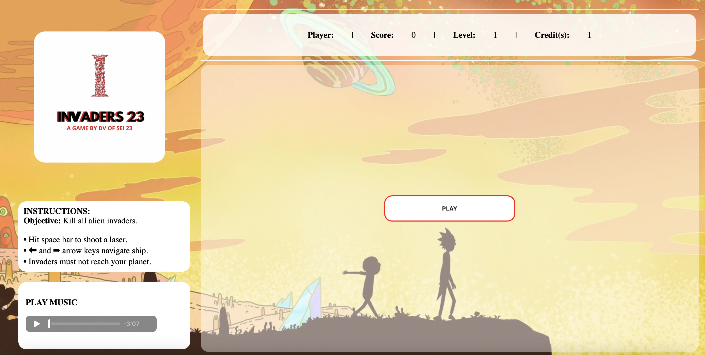
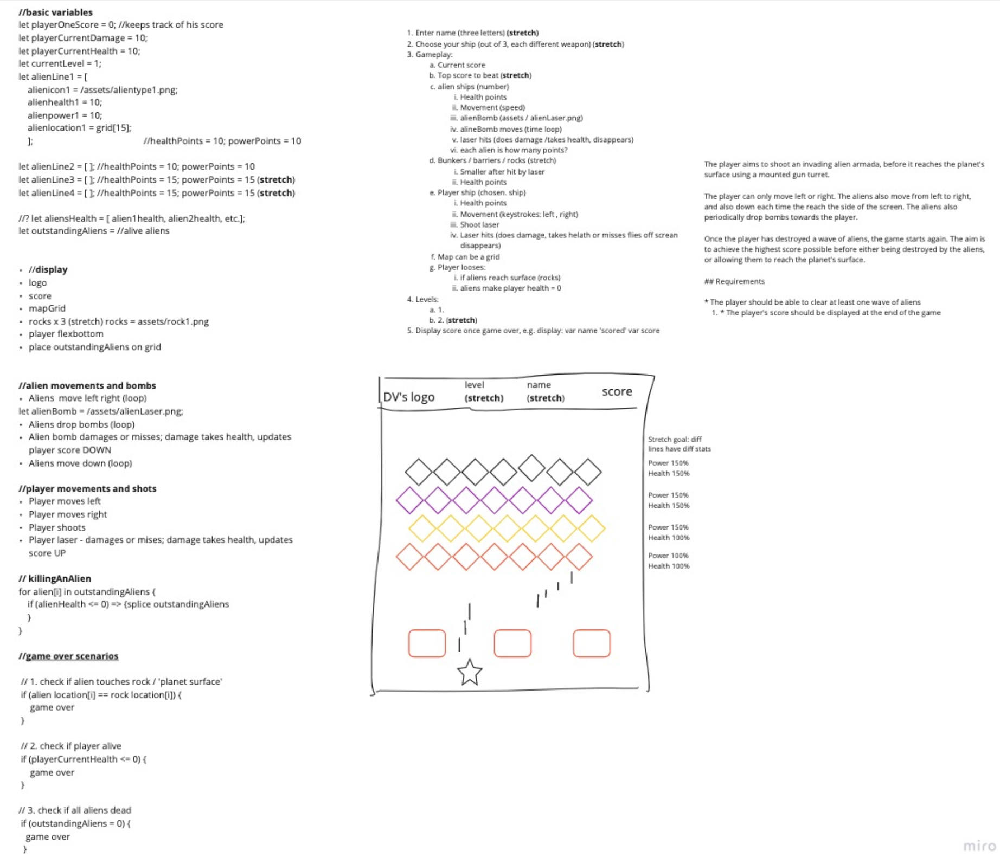
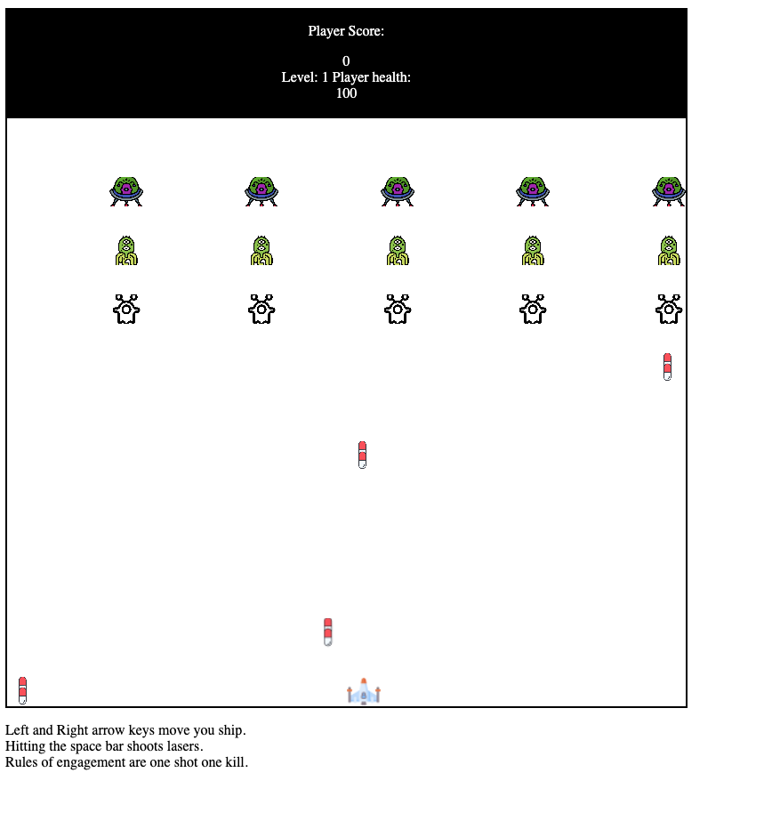

### 
# Dimitar Vidolov's project #1
part of General Assembly's Software Engineering Immersive, Flex, class #23. 

Timeframe: 9 days

## Goal
Create a fully functional web-based game of my choice using vanilla JavaScript.

## Technologies used:
* JavaScript
* CSS3 with animation
* Git
* Github
* HTML5 with HTML5 audio

# Invaders 23 

First project as part of the software engineering immersive course at GA London. The assignment was to create a grid-based game to be rendered in the browser, using HTML, CSS and JavaScript. The project was to be completed **individually**.

Given a list of options from GA, I chose to re-create the classic game **Space Invaders**. 

You can launch the game [here](https://dumblevor.github.io/spce_inv1/) and the repo is [here](https://github.com/Dumblevor/spce_inv1).

Here is a quick demo: 

<!--  -->
Controls are clearly visible on the right hand side and you can toggle playing a catchy tune to go with your gameplay (stretch goal), not to mention the sound effects (stretch goal) and your pointer will dissappear while playing (stretch goal).

## Brief

- Render a game in the browser.
- Design logic for winning & visually display when player wins.
- Include separate HTML / CSS / JavaScript files.
- Stick with KISS (Keep It Stupid Simple) and DRY (Don't Repeat Yourself) principles.
- Use Javascript for **DOM manipulation.
- Deploy your game online, where the rest of the world can access it.
- Use semantic markup for HTML and CSS (while adhering to best practices).

## Approach

Space Invaders was one of the more interesitng, with several moving parts and it seemed like a worthy challenge. 
Breaking it all down was key, from the 'sign-off' of the project.
Here is my whiteboard:

Actitivities are broken down into seperate components, hardcoding is kept quite low for the most part.
The grid is generated (by makeGrid()) with fixed size, elements on the grid are moved by adding and removing classes on the grid with time intervals and I put listeners to detect collisions.
The locations of the elements are all kept in seperate arrays.

Timeline overview:

- Day 1 - Planning & psudo
- Day 2 - setting up basics
- Day 3-4 - MVP up
- Day 6-8 - Improving movement, adding infinite levels (stretch 2 goal) and a modal (stretch 2 goal).
- Day 8-9 - High value low effort fetaures added like music, background, animations for explosions and 'flying' (stretch 3 goals). 

# Intro
### Elements set-up 
None of the elements (aliens, rocks, player's ship, etc.) are hard hardcoded, but generated as needed.
The end of movement of the aliens to the right starts the movement to the left. 
Player's lasers and aliens' bombs move with intervals, new bombs deployment speeds up on level change (stretch).
Level changes are stored in local storage.
Variables set-up is grouped in the beginning, followed by all the functions needed, gameInit() starts the game and it is followed by the modal for the player's name and win screen. 

### Bits & bobs
Lasers dissapear on collision with aliens, when they reach the end of the screen and when they hit a rock (see cheatcode below).
Aliens' bombs dissapear on collision with palyer and end of screen.
Aliens can appear on opposite end of screen on higher levels which can be improved. 

# Timeline
## Day 2

Grid is up. At this point I had to decide and test alien invaders configuration and number.
Making sure player can move left and right, within expected limits. 

## Day 3 

Here it was time to think about the movement width and speed, as well as speed for the alien attacks and the player's.
All locations of the different items/elements are kept in arrays and updated or removed as needed.

***Cheat code:*** if you shoot lasers very quickly they will pass through the rocks.

# Assets & credits

- Logo: Dimitar Vidolov  (canva.com).
- Ship flame 'animation': Dimitar Vidolov (canva.com).
- Player 1 spaceship: Dimitar Vidolov (canva.com).
- Icons (rocks, ships) from flaticon.com